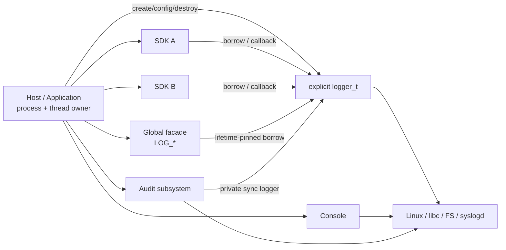
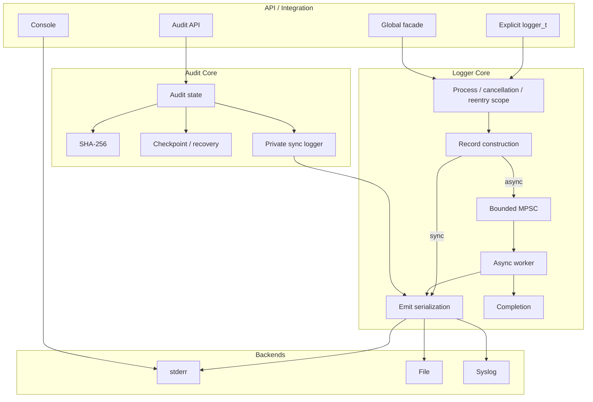
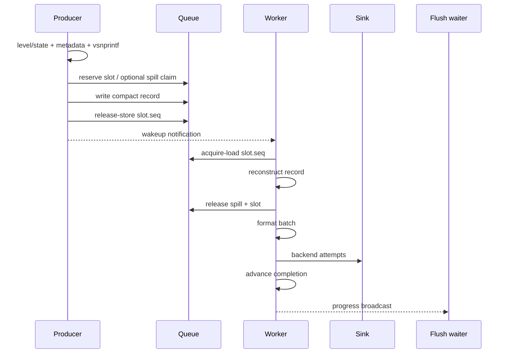
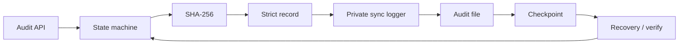

# c-logger 总体架构

> 本文是 c-logger 的**顶层架构入口**。
> 它回答“系统由什么组成、数据怎么流、谁拥有资源、线程如何协作、哪些边界不能被破坏”。
>
> 严格 review gate 见 `ARCHITECTURE_INVARIANTS.md`；
> backend、locking、Audit 等实现细节继续以专项文档为准。

## 1. 定位

c-logger 是面向 Linux/ELF 的 C 日志库，主要嵌入宿主应用或第三方 SDK 集成环境。

当前定位：

- public API 是 plain C ABI；
- C11 language baseline + GNU C extensions；
- 宿主显式拥有 `logger_t`；
- SDK 默认 borrow Logger 或使用宿主 callback；
- 支持 sync / async 普通日志；
- 支持 stderr、普通文件、本地 datagram Syslog；
- 提供独立 Console；
- 提供独立 Audit 子系统；
- bounded memory；
- overflow、I/O、durability failure 显式可见；
- 不接管宿主 process/thread/fork model。

当前版本仍是发布工程候选，不等于 Production v1 已完成目标平台和掉电语义验收。

## 2. Architecture Goals

架构优先保证：

1. **Host-neutral**：库不接管宿主业务线程、进程创建和 fork 策略；
2. **明确 ownership**：创建、borrow、move、最终 release 可追踪；
3. **Bounded resources**：queue、spill、workspace 有明确上界；
4. **Failure visibility**：不能静默隐藏 overflow、I/O、durability 或平台能力失败；
5. **Deterministic lifecycle**：worker 必须 cooperative stop + join；
6. **Correct concurrency**：lock、atomic、lifetime pin、join 各司其职；
7. **Caller lifetime isolation**：async enqueue 后不再依赖 SDK source pointer；
8. **Performance with evidence**：性能修改必须通过 benchmark 和 sanitizer/TSan 验证。

## 3. Non-Goals

当前不承诺：

- NanoLog 类极限 binary/deferred logging latency；
- 任意多线程 raw fork 后继续使用继承 runtime；
- 无限 queue 或“永不丢日志”；
- remote Syslog durable acknowledgement/replay；
- 多 consumer 并发写同一普通文件；
- signal-safe 普通日志；
- 通用 async-cancel-safe；
- io_uring 作为 Linux 3.10+ 基础依赖；
- 自动管理第三方 SDK 生命周期。

未来可以增加 fast structured/binary API，但不能偷偷改变现有 printf-compatible API 的语义。

## 4. System Context



责任边界：

```text
Host owns
    process
    application threads
    SDK lifetime
    explicit logger_t lifetime
    fork/exec policy

Logger owns
    per-instance worker
    queue + spill
    worker workspace
    file/syslog backend
    completion state

SDK borrower owns
    neither logger_t nor Logger worker/backend
```

## 5. Public API Layers

### Explicit instance

第三方集成的推荐入口：

```text
logger_create()
    ->
logger_log()/LOGGER_INFO(...)
    ->
logger_flush_instance_status()
    ->
logger_destroy_status()
```

宿主是 structural owner。

多个 caller/SDK 可以 borrow 同一实例，但 owner 必须在 destroy 前停止并 join 所有 borrower。

当前没有 generic `logger_get()/logger_put()`；并发 destroy/use 属于 caller 违反生命周期契约。

### Global facade

`logger_init()/LOG_*/logger_shutdown_status()` 是应用 convenience layer。

内部使用：

- generation + phase atomic ticket；
- controller mutex；
- lifetime rwlock；
- hidden `g_logger`。

Global caller 只能 lifetime-pinned borrow，不能取得 owning pointer。

### Console

独立终端工具：

- process-static atomic config；
- 独立 output mutex；
- 不使用 Logger queue/backend；
- 不作为 SDK 隐式输出通道。

### Audit

独立 process-global security subsystem：

- single writer；
- 自己的 state machine；
- private synchronous Logger；
- SHA-256 chain；
- checkpoint/recovery；
- fail-closed error state。

普通 Logger 的成功返回不能解释为 Audit commit receipt。

## 6. Component Model



## 7. Thread Model

### Sync instance

不创建 Logger worker：

```text
caller
  -> construct record
  -> format
  -> emit_mu
  -> backend I/O
  -> return
```

### Async instance

当前每个 async `logger_t` 创建一个 private worker：

```text
Producer 1 ─┐
Producer 2 ─┼─> bounded shared MPSC ─> single worker ─> sinks
Producer N ─┘
```

single worker 和 shared MPSC 是**当前实现选择**，不是永久 architecture invariant。

如果未来改成 per-thread SPSC/sharding，必须重新处理 TLS registration、dead-thread reclaim、
fork/dlclose、destroy、fairness 和 flush aggregation。

## 8. Sync Data Path

```text
public API
  -> process/cancellation/reentry scope
  -> level/state check
  -> timestamp + required metadata
  -> vsnprintf
  -> logger_emit_status()
  -> final line format
  -> emit_mu
  -> stderr/file/syslog
  -> metrics + sticky error
  -> return
```

特点：

- caller input 只需在本次调用期间有效；
- I/O 在 caller thread；
- 没有 queue buffering；
- status API 可以直接观察 backend error。

## 9. Async Data Path



当前 API 仍是 eager printf-compatible path：

```text
printf args -> vsnprintf -> queue text
```

不是 binary/deferred-format architecture。

未来 fast path 若采用 typed/binary serialization，应作为独立 API/contract。

## 10. Queue / Spill Architecture

当前 queue：

- bounded shared MPSC；
- per-slot sequence generation；
- release/acquire publication；
- compact metadata/source/context；
- text <= 512B inline；
- text > 512B 使用预分配 spill block；
- spill ownership 使用 atomic bitmap；
- no per-record malloc/free；
- worker batch 最大 256。

### Publication

```text
producer
  reserve enqueue position
  -> write compact record / spill
  -> release-store slot.seq

consumer
  acquire-load slot.seq
  -> read/copy record
  -> release spill
  -> release-store reusable slot.seq
  -> advance dequeue_pos
```

`slot.seq` 承担 payload publication；
`enqueue_pos/dequeue_pos` 主要承担 reservation/accounting。

### Source lifetime

module/file/function 在 enqueue 时做 bounded snapshot。

所以 SDK/caller 返回甚至 DSO 合法卸载后，已经入队的日志不再依赖原 source pointer。

### Spill

默认最多 1024 blocks。

spill 是 long-message burst capacity，不是 durable queue，也不是持续 overload 的解决方案。

## 11. Backpressure

queue/spill 无资源时：

```text
unavailable
    |
    +-- DROP
    |    -> dropped_by_level++
    |
    +-- SYNC
         -> caller thread synchronous emit
         -> sync_fallbacks++
```

默认 ERROR/FATAL 使用 SYNC fallback，其余级别默认 DROP。

buffer sizing 应理解为：

```text
burst capacity
≈ peak producer rate × tolerated consumer stall
```

而不是让持续 producer rate > consumer rate 永久成立。

## 12. Worker / Batch / Sinks

worker 当前：

```text
drain <= 256 records
  -> format each line
  -> emit batch
  -> update completion
  -> continue

queue empty
  -> wait on q.wait_cv
```

sink 当前行为：

| Sink | Async batch |
|---|---|
| stderr | `writev` |
| file | `writev` |
| Syslog | per-record `send` |

因此当前明确的未来候选包括：

- self-paced wakeup；
- demand-driven producer metadata；
- consumer-stage profiling；
- Syslog `sendmmsg()`；
- adaptive batch/backpressure。

## 13. Completion / Flush

最重要的 invariant：

> **queue empty / dequeue != backend completion。**

三个状态：

```text
dequeue_pos
    = slot 已被 consumer 取得

async_completed
    = backend attempt 完成

completed_pos
    = flush/wait 使用的 watermark
```

flush：

```text
snapshot reservation target
  -> wait completed_pos reaches target
  -> backend sync if required
```

不能把“queue 空了”解释成“已经 write/fsync”。

## 14. Backend Model

### stderr

- sync path 单 record；
- async path batch `writev`；
- SIGPIPE 使用 thread-local mask guard；
- 不改变 process-global signal disposition。

### File

一个 file backend structural owner 持有：

```text
dir_fd
active fd
coordination lock fd
rotation/reopen state
```

关键规则：

- regular target 单协作 owner；
- bind 后通过 dirfd 操作；
- no-clobber rotation；
- replacement 完成验证后再切换；
- fsync/dir fsync error 可观察；
- coordination lock 是 ownership/exclusivity，不是安全防篡改边界。

细节见 `FILE_BACKEND.md`。

### Syslog

当前是 local UNIX datagram：

- nonblocking；
- bounded send attempts；
- monotonic reconnect cooldown；
- future-record-triggered reconnect；
- no replay queue；
- backpressure 作为 failed record 可见。

细节见 `SYSLOG_BACKEND.md`。

## 15. Ownership / Lifecycle

核心状态：

```text
OWNED
BORROWED
MOVED
SHARED
REFCOUNTED
```

当前 production 没有 generic REFCOUNTED object。

### Logger lifecycle


successful constructor 只在 return boundary 把 ownership 交给 caller。

destroy consumes ownership；final I/O error 不代表旧 pointer 可重试。

### Worker/queue release order

```text
stop admission/running
  -> wake worker
  -> worker drain/exit
  -> pthread_join
  -> destroy workspace
  -> destroy queue
```

### Global lifetime

Global reader 持 lifetime rwlock pin 时 borrow hidden `g_logger`。

该 pin 不是 refcount。

详细规则见 ownership/lifecycle 专项文档。

## 16. Lock / Atomic Model

不同机制不可混用：

```text
lock
  -> serialize invariant

atomic
  -> publication / individual state

lifetime pin
  -> object stays alive while borrowed

join
  -> worker no longer uses resources

refcount
  -> independent owners retain lifetime
```

### Global lock order

```text
g_control_mu
  -> g_lifetime_lock
  -> logger instance locks
```

### Instance synchronization

```text
emit_mu
  -> backend mutable state / output order

progress_mu
  -> completed_pos / progress_cv

q.wait_mu
  -> worker sleep/wakeup only
```

Queue atomics：

```text
slot.seq        payload publication/reuse
enqueue_pos     reservation
dequeue_pos     consumption accounting
spill_used[]    spill block ownership
running         worker stop state
```

完整顺序见 `LOCKING.md`、`LOCK_MATRIX.md`、`CONCURRENCY.md`。

## 17. Error / Durability

内部 helper 通常：

```text
0 / -errno
```

POSIX-style public status API 通常：

```text
0 / -1 + errno
```

核心原则：

- preserve first meaningful error；
- backend first I/O error sticky；
- partial write 不静默 success；
- error-bearing finalization 保持显式；
- unsupported capability 返回错误，不做危险降级。

普通 Logger：

```text
enqueue success
  != backend completion
  != fsync durability
```

Audit durability 是独立契约，不能从普通 Logger 推导。

## 18. Process / Fork / Cancellation

Logger 不拥有宿主 process model。

默认路径：

- 不调用 fork；
- 不扫描宿主线程决定 fork safety；
- raw multi-threaded fork child 在触碰继承锁前 ECHILD；
- 推荐 fork-before-runtime-use 或 fork+exec；
- legacy controlled helper 仅 opt-in。

普通 Logger/Console resource path：

- deferred cancellation 在关键区间暂时禁用；
- cleanup/lock release 后恢复 caller state；
- same-thread resource reentry 在拿锁前拒绝；
- 不宣称通用 async-cancel-safe；
- 不允许 `pthread_exit/longjmp` 绕过资源协议。

## 19. Audit Architecture



关键边界：

- process-global single writer；
- private Logger 使用 sync mode；
- crypto failure fail closed；
- unsupported algorithm 不自动映射；
- committed log 与 checkpoint 是不同状态；
- uncertain I/O/crypto 进入显式 failure state；
- recovery 不静默改写历史证据；
- recovery 前先建立 writer ownership。

Audit security/durability 优先级高于普通日志 throughput。

## 20. Performance Architecture

当前 async compatibility path 的性能原则：

- bounded preallocation；
- no per-record heap allocation；
- compact queue；
- short text inline；
- batch format/writev；
- producer/worker concurrency；
- benchmark-backed tuning。

已完成的 queue 优化结果见：

- `../validation/QUEUE_BENCHMARK.md`
- `../validation/QUEUE_HOTPATH.md`

### Current implementation，允许演进

- shared MPSC；
- single worker；
- 512B inline；
- 1024 spill blocks；
- atomic spill bitmap；
- BATCH_MAX=256；
- eager `vsnprintf`；
- metadata capture；
- worker wakeup policy；
- sink batching。

### Architecture invariant，不得用性能优化破坏

- bounded memory；
- no per-record async malloc in compatibility path；
- explicit overflow policy；
- no silent overflow truncation；
- source lifetime detached after enqueue；
- flush != queue empty；
- backend error visible；
- owner controls worker lifetime；
- join-before-free；
- file ordering/ownership；
- host-neutral process/thread boundary。

完整规则见 `ARCHITECTURE_INVARIANTS.md`。

## 21. Extension Boundaries

### 新 backend

至少必须定义：

- structural owner；
- init/close；
- locking；
- batching；
- backpressure；
- retry/reconnect；
- error metrics；
- durability；
- fork/dlclose boundary。

### 新 queue topology

SPSC shard/per-thread queue 必须重新证明：

- bounded total memory；
- TLS lifetime/reclaim；
- logger destroy；
- fork/dlclose；
- fairness/order；
- flush completion aggregation；
- source ownership；
- backpressure。

### 新 fast logging API

应明确区分：

```text
existing API
  -> eager printf-compatible copy

future fast API
  -> typed/binary serialization
  -> deferred format
```

不能让旧 API 在 caller return 后继续借用可变 printf 参数。

## 22. Near-term Evolution

当前推荐顺序：

```text
self-paced queue wakeup
  ->
demand-driven producer metadata
  ->
consumer stage profiling
  ->
Syslog batching if evidence supports
  ->
adaptive batch/backpressure
  ->
evaluate queue sharding / per-thread SPSC
  ->
optional binary structured fast API
```

每轮必须：

- 保留 Architecture Invariants；
- 更新专项文档；
- 增加 correctness regression；
- 通过 Release/Debug/ASan/UBSan/TSan；
- 性能使用同 runner before/after benchmark。

## 23. Documentation Authority

| 主题 | 权威文档 |
|---|---|
| 总体组件 / 数据流 / 边界 | **ARCHITECTURE.md** |
| 不可破坏 review gate | **ARCHITECTURE_INVARIANTS.md** |
| public API / integration | `../API.md`, `HOST_OWNED.md` |
| lifecycle | `LIFECYCLE.md`, `GLOBAL_LIFECYCLE.md` |
| ownership | `RESOURCE_OWNERSHIP.md`, `RESOURCE_OWNERSHIP_MATRIX.md` |
| refcount | `REFCOUNTING.md` |
| cleanup | `RESOURCE_CLEANUP.md` |
| lock hierarchy | `LOCKING.md`, `LOCK_MATRIX.md` |
| atomic/publication | `CONCURRENCY.md` |
| queue | `QUEUE_STORAGE.md` |
| errors | `ERROR_HANDLING.md` |
| file | `FILE_BACKEND.md` |
| syslog | `SYSLOG_BACKEND.md` |
| crypto | `BUILTIN_CRYPTO.md` |
| platform | `PLATFORM_BASELINE.md` |
| release | `RELEASE_ENGINEERING.md` |
| unresolved boundaries | `KNOWN_ISSUES.md` |

发生冲突时：

1. 先判断是否属于 architecture change；
2. architecture change 必须同一 PR 更新顶层文档和专项文档；
3. 单纯实现细节以专项文档为准，但不能违反 Architecture Invariants。
