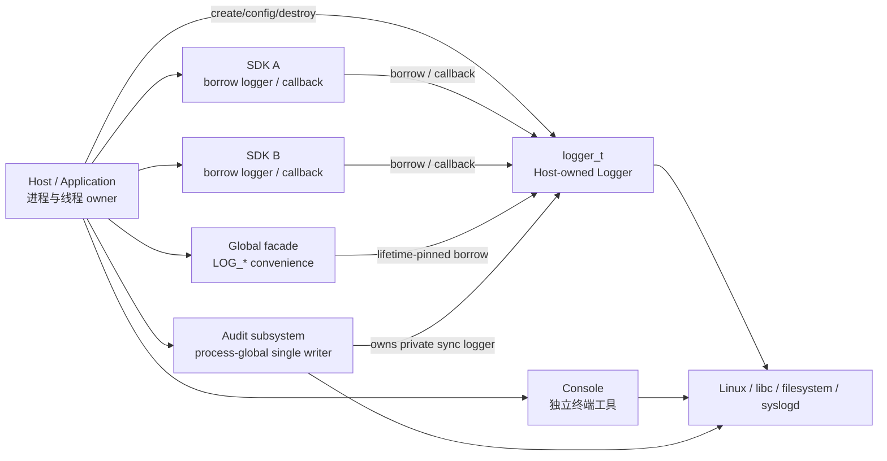
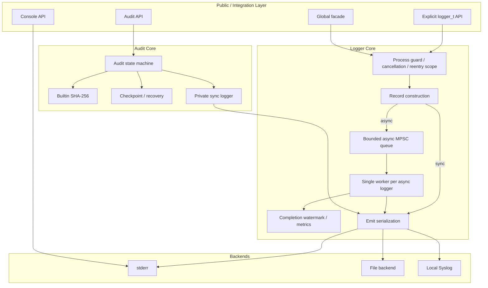
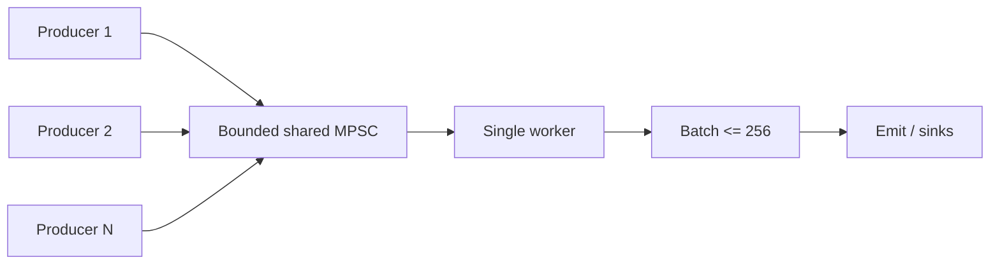
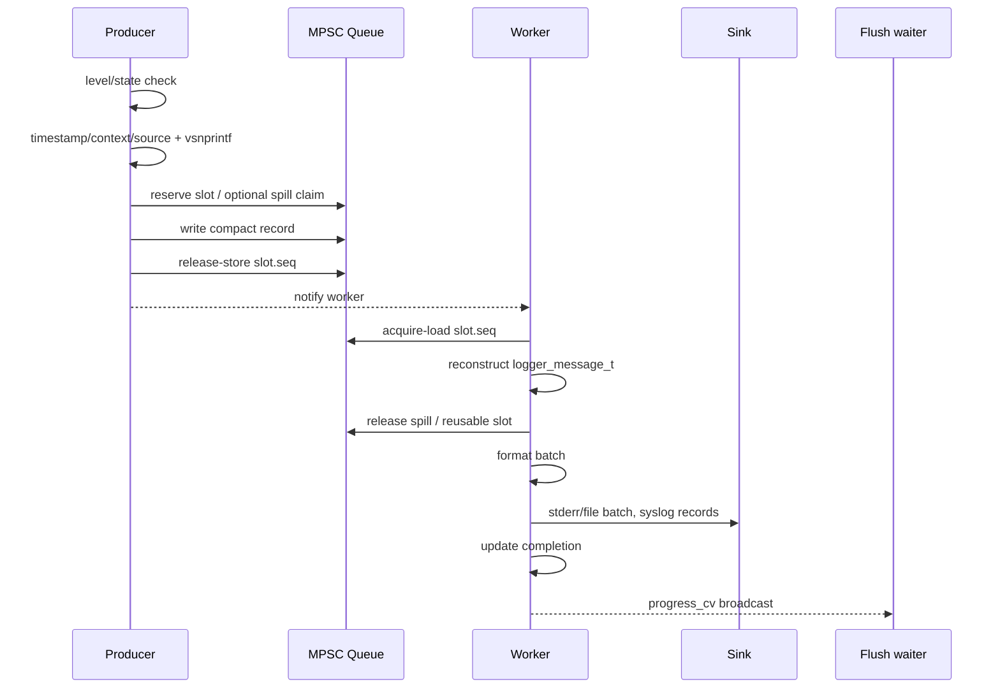
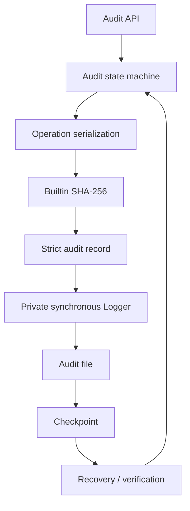

# c-logger 总体架构

> 本文是 c-logger 的**顶层架构入口**。它定义系统边界、组件职责、数据流、线程模型、
> ownership/lifetime、并发与错误语义，以及不可被局部优化破坏的 Architecture Invariants。
>
> 各模块的实现细节仍以对应专项文档为准；本文不重复所有 backend、Audit、locking
> 和 release engineering 细节。

## 1. 项目定位

c-logger 是面向 Linux/ELF 的 C 日志库，主要作为共享库或静态库嵌入宿主程序。

当前核心定位：

- public API 保持普通 C ABI；
- C11 language baseline + GNU C extensions；
- 宿主显式拥有 `logger_t`，第三方 SDK 默认只 borrow Logger 或使用宿主 callback；
- 支持同步与异步普通日志；
- 支持 stderr、普通文件、本地 datagram Syslog；
- 提供独立 Console 工具；
- 提供独立 Audit 子系统，包含 SHA-256 hash chain、checkpoint/recovery 和 single-writer 约束；
- bounded memory、显式 overflow policy、显式 I/O error；
- 不接管宿主的进程模型、线程池、fork 策略或业务生命周期。

当前版本是发布工程候选，不等于已经完成所有目标平台、持久化和 Production v1 验收。

详细平台边界见 `PLATFORM_BASELINE.md`，发布边界见 `RELEASE_ENGINEERING.md`。

## 2. Architecture Goals

架构首先优化以下目标，排序高于单项 microbenchmark：

1. **Host-neutral**：库不能把自己的进程/线程模型强加给宿主；
2. **明确 ownership**：创建、borrow、move、最终释放必须可追踪；
3. **Bounded resource usage**：异步 queue、spill、worker workspace 都有明确上界；
4. **Failure visibility**：I/O、durability、overflow、unsupported capability 不能静默伪装成功；
5. **Deterministic lifecycle**：worker、queue、backend 必须在 owner 控制下 stop/join/release；
6. **Correct concurrency**：atomic publication、lock、lifetime pin、join 各自承担清晰职责；
7. **Source lifetime isolation**：异步记录不能继续引用 caller/SDK 的短生命周期字符串；
8. **No silent truncation of queue overflow**：资源不足通过 DROP/SYNC policy 表达；
9. **Performance with evidence**：性能改动必须通过可复现 benchmark 验证，不靠“lock-free”标签推断；
10. **可演进**：允许以后替换 queue/wakeup/format/sink batching，但不能破坏上述 invariant。

## 3. Non-Goals

当前架构**不承诺**：

- NanoLog 类 10ns 级 binary/deferred logging；
- 任意多线程 raw `fork()` 后继续复用继承 runtime；
- 远端 Syslog durable acknowledgement 或失败记录 replay；
- 跨 NFS/SMB 的强一致分布式文件锁；
- 多个 consumer 并发写同一普通文件；
- 无限 queue 或“永不丢日志”；
- signal-handler safe 普通日志 API；
- 通用 async-cancel-safe；
- 自动管理第三方 SDK 生命周期；
- 自动扫描宿主线程/进程来决定何时安全 fork/destroy；
- io_uring 作为 Linux 3.10+ 的基础依赖。

未来可以新增更快的 structured/binary API，但不能偷偷改变现有 printf-compatible API 的语义。

## 4. System Context



最重要的边界：

```text
Host owns:
    process
    application threads
    SDK lifetime
    explicit logger_t lifetime
    fork/exec policy

Logger owns:
    per-instance worker
    async queue
    worker workspace
    file/syslog backend resources
    completion state

SDK borrower owns:
    neither logger_t nor Logger worker/backend
```

## 5. Public API Layers

### 5.1 Explicit-instance API

这是第三方集成的推荐入口。

```text
logger_create()
    ->
logger_log()/LOGGER_INFO(...)
    ->
logger_flush_instance_status()
    ->
logger_destroy_status()
```

宿主是唯一 structural owner。

业务 SDK 和调用线程只 borrow：

```text
Host owns logger_t
    |
    +-- caller A BORROWED
    +-- caller B BORROWED
    +-- SDK callback BORROWED
    |
Host stops/joins borrowers
    |
logger_destroy_status()
```

并发 destroy/use 属于 caller 违反生命周期契约，当前没有通用 per-object refcount 替 caller 修复该问题。

### 5.2 Global facade

`logger_init()/LOG_*/logger_shutdown_status()` 是应用 convenience layer，不是第三方 SDK 默认入口。

它内部使用：

- generation + phase atomic ticket；
- controller mutex；
- lifetime rwlock pin；
- hidden `g_logger`。

Global API 从不把 owning `logger_t *` 暴露给 caller。

详细语义见 `GLOBAL_LIFECYCLE.md`。

### 5.3 Console

Console 是独立的终端展示工具：

- process-static atomic config snapshot；
- 独立 `g_console_mu` 串行 FILE 输出；
- 不依赖 Logger queue/backend；
- 不作为 SDK 隐式日志通道。

### 5.4 Audit

Audit 是独立 process-global security/audit subsystem：

- single writer；
- 自己的 lifecycle / operation locking；
- private synchronous Logger；
- SHA-256 hash chain；
- checkpoint + recovery；
- fail-closed crypto/state rules。

普通 Logger 成功返回不等于 Audit commit/durability receipt。

## 6. Component Model



## 7. Logger Instance Structure

每个 `logger_t` 概念上分成五类状态：

```text
immutable configuration
    detail / outputs / async_mode / include_* / flush_level

atomic control/state
    level / state / running / counters / sticky error

backend state
    file_backend / syslog_backend
    protected by emit_mu

async state
    q / worker_workspace / worker

completion state
    progress_mu / progress_cv / completed_pos
```

设计原则：

- immutable field 在成功 construction/publish 后不再变化；
- backend mutable state 由 `emit_mu` 串行化；
- queue publication 不依赖 `emit_mu`；
- completion wait 不等于 queue empty；
- worker resources 只能在 join 后释放。

## 8. Thread Model

### Sync logger

```text
caller thread
    ->
construct record
    ->
format
    ->
emit_mu
    ->
backend I/O
    ->
return
```

同步实例不会创建 Logger worker。

### Async logger

每个 async `logger_t` 当前创建一个 private worker。



当前 single worker 是**实现选择**，不是不可变 architecture invariant。

未来可以实验 queue sharding / per-thread SPSC，但必须重新设计：

- TLS queue registration/reclaim；
- dead-thread queue ownership；
- fork/dlclose；
- logger destroy vs TLS lifetime；
- consumer fairness；
- flush completion aggregation。

不能因为 benchmark 更快就直接替换现有模型。

## 9. Sync Data Path

```text
public call
    ->
process/cancellation/reentry scope
    ->
level/state check
    ->
record metadata
    ->
vsnprintf message
    ->
logger_emit_status()
    ->
format final line
    ->
emit_mu
    ->
stderr/file/syslog
    ->
I/O metrics + sticky first error
    ->
return
```

同步路径的重要语义：

- caller fmt/source/context 只需在调用期间有效；
- I/O 发生在 caller thread；
- backend error 可直接影响 status API；
- 没有 queue/backpressure buffering。

## 10. Async Data Path

当前 async compatibility path：



当前 producer 是 eager-format compatibility path：

```text
printf args
    ->
vsnprintf()
    ->
text record
    ->
queue
```

它不是 NanoLog/Quill 类 binary deferred-format architecture。

如果未来增加 binary structured fast path，应作为新语义路径，而不是静默改变现有 API。

## 11. Queue Architecture

当前 queue：

- bounded shared MPSC；
- per-slot sequence generation；
- release/acquire publication；
- compact metadata/source/context snapshot；
- 正文 <= 512B inline；
- 正文 > 512B 使用预分配 spill block；
- spill ownership 使用 lock-free atomic bitmap；
- no per-record malloc/free；
- worker batch 最大 256。

### Publication

```text
Producer:
reserve enqueue position
    ->
write compact record / spill text
    ->
release-store slot.seq

Consumer:
acquire-load slot.seq
    ->
read record
    ->
copy to worker batch
    ->
release spill block
    ->
release-store reusable slot.seq
    ->
advance dequeue_pos
```

`enqueue_pos/dequeue_pos` 是 reservation/accounting，不替代 `slot.seq` publication。

### Source lifetime

async queue 对 module/file/function 做有界 snapshot。

因此已经成功 enqueue 的 record 不依赖业务 SDK 的 .rodata 或 SDK instance memory 继续存活。

### Spill

默认最大 spill blocks = 1024。

spill pool 是 burst buffer，不是“永不丢 long-message”的 durable queue。

## 12. Backpressure Model

资源不足必须显式表达。

当前 per-level policy：

```text
queue/spill unavailable
    |
    +-- LOGGER_OVERFLOW_DROP
    |      -> dropped_by_level++
    |
    +-- LOGGER_OVERFLOW_SYNC
           -> caller thread synchronous emit
           -> sync_fallbacks++
```

默认高严重级别 ERROR/FATAL 使用 SYNC fallback，其他级别默认 DROP。

Architecture invariant：

> 不允许为了“看起来不丢日志”而无限 malloc、无限 queue、静默截断或隐藏 backpressure。

buffer sizing 应被理解为：

```text
required burst capacity
≈ producer peak rate × tolerated consumer stall
```

而不是持续 producer rate 大于 consumer rate 时的永久解决方案。

## 13. Worker / Batch Architecture

worker 循环：

```text
drain queue up to BATCH_MAX(256)
    ->
format each record
    ->
emit_batch()
    ->
update async completion
    ->
broadcast progress waiters
    ->
continue

if queue empty:
    wait on q.wait_cv
```

当前 sink 行为：

- stderr：batch `writev`；
- file：batch `writev`；
- Syslog：当前逐 record send；
- completion：backend attempt 完成后推进。

当前明显的未来优化点：

- self-paced wakeup，避免每个 enqueue 都 `wait_mu + cond_signal`；
- demand-driven metadata capture；
- consumer stage profiling；
- Syslog `sendmmsg()` batching；
- adaptive batching。

这些是 implementation evolution，不改变 core ownership/lifecycle invariant。

## 14. Completion / Flush Model

Architecture invariant：

> **Queue dequeue/empty 不等于 backend completion。**

三种不同状态：

```text
dequeue_pos
    = consumer 已取得 slot

async_completed
    = backend attempt 已完成

completed_pos
    = flush/wait 使用的 completion watermark
```

因此 flush 必须：

```text
snapshot reservation target
    ->
wait completed_pos reaches target
    ->
only then perform backend sync if required
```

不能把：

```text
queue empty
```

解释成：

```text
data already written / synced
```

详细语义见 `CONCURRENCY.md` 和 `ERROR_HANDLING.md`。

## 15. Backend Architecture

### 15.1 stderr

- normal sync path 单 record；
- async batch 使用 `writev`；
- SIGPIPE 通过 thread-local mask guard 处理；
- 不改变 process-global signal disposition。

### 15.2 File backend

一个 file backend structural owner 持有：

```text
dir_fd
active fd
coordination lock fd
rotation/reopen state
```

主要 invariant：

- regular target 单协作 owner；
- bind 后通过 dirfd 操作，不重新解释 cwd；
- rotation 使用 no-clobber rename；
- replacement fd 完整验证后才切换；
- fsync/dir fsync error 可观察；
- coordination lock 是 ownership/exclusivity，不是安全防篡改边界。

详见 `FILE_BACKEND.md`。

### 15.3 Syslog backend

当前是 local UNIX datagram：

- nonblocking socket；
- bounded send attempt；
- future-record-triggered reconnect；
- monotonic cooldown；
- no replay queue；
- backpressure 作为 failed record 可见。

当前 async batch 对 Syslog 仍逐 record send，是未来 consumer-side 优化点。

详见 `SYSLOG_BACKEND.md`。

## 16. Ownership / Lifetime Architecture

核心分类：

```text
OWNED
BORROWED
MOVED
SHARED
REFCOUNTED
```

当前 production 没有 generic REFCOUNTED object。

### Logger instance

```text
logger_create()
    -> host OWNED

logger_log(logger)
    -> BORROWED during call

logger_destroy_status()
    -> consumes owner
    -> stop worker
    -> join
    -> release resources
    -> free
```

### Queue / worker

```text
logger_t owns:
    q.slots
    q.spills
    worker_workspace
    worker thread
```

释放顺序：

```text
stop admission/running
    ->
wake worker
    ->
drain/exit
    ->
pthread_join
    ->
destroy workspace
    ->
destroy queue
```

### Global logger

Global readers通过 lifetime rwlock pin borrow hidden `g_logger`。

该 pin 不是 refcount。

### Audit

Audit runtime、private logger、checkpoint state、writer lock 都属于 Audit subsystem；
不能用 lexical cleanup 把其完整 lifecycle 简化成局部变量释放。

详细规则见：

- `RESOURCE_OWNERSHIP.md`
- `RESOURCE_OWNERSHIP_MATRIX.md`
- `REFCOUNTING.md`
- `RESOURCE_CLEANUP.md`

## 17. Lock / Atomic Architecture

不同机制回答不同问题：

```text
mutex/rwlock
    -> serialize invariant

atomic
    -> publication / individual state

lifetime pin
    -> object remains alive while borrowed

join
    -> thread no longer accesses resources

refcount
    -> independent owners retain lifetime
```

### Global hierarchy

```text
global g_control_mu
    ->
global g_lifetime_lock
    ->
logger instance locks
```

### Logger locks

```text
emit_mu
    -> backend mutable state / output ordering

progress_mu
    -> completed_pos / progress_cv

q.wait_mu
    -> worker sleep/wakeup protocol only
```

当前这些 instance/queue mutex 不允许随意互相嵌套。

### Queue atomics

```text
slot.seq
    -> payload publication / reuse generation

enqueue_pos / dequeue_pos
    -> reservation/accounting

spill_used[]
    -> long-message block ownership

running
    -> cooperative worker stop
```

详细 lock order 见 `LOCKING.md` 和 `LOCK_MATRIX.md`。

## 18. Error Architecture

内部 helper 通常：

```text
0 / -errno
```

POSIX-style public status API 通常：

```text
0 / -1 + errno
```

错误模型核心原则：

- 第一个有意义错误不能被 cleanup error 覆盖；
- backend first I/O error sticky；
- partial write 不静默提升为 success；
- fsync/dir fsync/rotation/reopen/final close 等错误不能隐藏进自动 destructor；
- unsupported capability 返回明确错误，不提供危险降级；
- overflow/drop/sync fallback 通过 metrics/policy 表达。

详细规则见 `ERROR_HANDLING.md`。

## 19. Durability Boundary

普通 Logger 与 Audit 的 durability 语义不同。

### Ordinary Logger

```text
enqueue success
    != backend completion

backend completion
    != fsync durable

flush success
    = 当前契约要求的 completion + backend sync
```

Syslog flush 不等于远端 durable acknowledgement。

### Audit

Audit 可以要求每 record fsync，并维护：

- committed sequence；
- hash chain；
- checkpoint；
- recovery state；
- failure state。

Audit durability/recovery 是独立安全契约，不能从普通 Logger flush 语义推导。

## 20. Process / Fork Boundary

Library 不拥有宿主进程模型。

默认 runtime：

- 不调用 fork；
- 不扫描 `/proc/self/task` 决定宿主线程状态；
- raw multi-threaded fork 后继承 runtime 会被 child guard 拒绝；
- child 在触碰继承 mutex/once/resource 前返回 ECHILD；
- 推荐 fork-before-runtime-use 或 fork+exec。

legacy controlled fork helper 是 opt-in compatibility path，不属于新架构主路径。

## 21. Cancellation / Reentry Boundary

普通 Logger/Console resource path 使用 private scope：

- deferred cancellation 在资源关键区间暂时禁用；
- 锁和临时资源释放后恢复 caller state；
- same-thread resource reentry 在拿锁前拒绝；
- 不把普通 API 宣称为 async-cancel-safe；
- 不允许 `pthread_exit/longjmp` 穿过受保护调用来绕过 cleanup。

这属于 host-neutral resource safety，不代表库接管 caller cancellation policy。

## 22. Audit Architecture



Audit 主要 architecture invariant：

- process-global single writer；
- private logger 是 synchronous；
- hash failure 不允许 zero-digest fallback；
- unsupported algorithm 不自动映射；
- committed log 与 checkpoint 状态必须区分；
- uncertain I/O/crypto failure 进入显式 failure state；
- recovery 不静默重写历史证据；
- Audit writer ownership 在 recovery 前建立。

Audit 的 security/durability contract 高于普通日志 throughput。

## 23. Performance Architecture

当前普通 async compatibility path 追求：

- no per-record heap allocation；
- bounded preallocation；
- compact queue；
- short message inline；
- batch formatting/writev；
- producer 与 worker 并发；
- benchmark-backed tuning。

当前已验证：

- compact queue 显著降低默认 queue memory；
- 512B inline 消除了 256B 的 spill pressure；
- lock-free spill bitmap 去除 long-message shared mutex；
- producer `text_len` 避免重复正文扫描。

详细结果见：

- `../validation/QUEUE_BENCHMARK.md`
- `../validation/QUEUE_HOTPATH.md`

### Performance architecture boundary

以下是当前 implementation，可以优化：

- shared MPSC；
- single worker；
- 512B inline threshold；
- 1024 spill blocks；
- BATCH_MAX=256；
- eager `vsnprintf`；
- producer metadata capture；
- worker wakeup policy；
- sink batching。

以下是 Architecture Invariants，性能优化不能破坏：

- bounded memory；
- no per-record malloc in current async compatibility path；
- no silent overflow truncation；
- source lifetime detached from caller after enqueue；
- flush != queue empty；
- backend error remains visible；
- owner controls worker lifetime；
- worker resources join-before-free；
- file ordering/ownership semantics；
- host-neutral process/thread boundary。

## 24. Extension Points

### 新 backend

必须定义：

- structural owner；
- init/close；
- lock protection；
- batch capability；
- backpressure；
- reconnect/retry；
- error metrics；
- durability meaning；
- fork/dlclose boundary。

不能只实现一个 `write()` 函数就认为 backend contract 完成。

### 新 queue topology

可以实验 SPSC shard/per-thread queue，但必须重新证明：

- bounded total memory；
- logger destroy 与 thread-local queue lifetime；
- dead-thread reclaim；
- fork/dlclose；
- fairness；
- global ordering requirement；
- flush completion aggregation；
- source ownership；
- backpressure。

### 新 fast logging API

如果增加 binary/deferred formatting，应作为独立 API/contract：

```text
existing API
    -> eager printf-compatible copy

future fast API
    -> typed/binary argument serialization
    -> backend thread format
```

不能让旧 API 在 caller 返回后继续引用 caller 的可变 printf 参数。

### 新 refcount

只有多个独立 owner 无法通过 join/pin/上层 lifetime protocol 确定最终 release 时才引入。

## 25. Architecture Invariants

下面是当前最重要的 review gate。

### Host / API

1. Logger 不接管宿主 process/thread/fork model。
2. 第三方 SDK 默认不自动创建/销毁 global Logger。
3. explicit `logger_t` 由 host structural owner 独占销毁。
4. public ABI 保持 plain C；内部 GNU C helper 不泄漏进 public contract。

### Ownership / Lifetime

5. 每个资源都必须能回答：谁创建、当前谁拥有、何时 transfer、最终谁释放。
6. BORROWED pointer 不能被 lexical cleanup 自动 release。
7. worker/queue/workspace 必须 join-before-free。
8. destroy consumes ownership；final I/O failure 不让旧 pointer 变成可重试。
9. lock、atomic、refcount、join、lifetime pin 不得混为一谈。

### Async / Queue

10. queue 必须 bounded。
11. async compatibility hot path 不使用 per-record heap allocation。
12. enqueue 后 source metadata 不依赖 caller/SDK lifetime。
13. overflow 必须通过明确 DROP/SYNC policy 处理。
14. 不允许 silent truncation 代替 resource exhaustion。
15. queue empty/dequeue 不能被当成 backend completion。

### Backend / Error

16. backend mutable state 有唯一 serialization contract。
17. file target ownership/rotation/reopen 不能破坏 no-clobber 与 old-state-before-new-state 规则。
18. error-bearing finalization 保持显式。
19. first meaningful backend error 不被后续成功清除。
20. unsupported platform capability 返回错误，不使用危险语义降级。

### Audit

21. Audit 是独立 security subsystem，不等价于普通 Logger。
22. Audit crypto failure fail closed。
23. Audit checkpoint success 与 log commit 是不同状态。
24. Audit recovery 不静默改写/伪造历史 chain。

### Performance

25. 性能优化必须以 benchmark 和 sanitizer/TSan 证据支撑。
26. “lock-free”不是 architecture correctness 的替代品。
27. 为 throughput 增加固定内存必须重新检查 bounded-memory tradeoff。
28. 不允许通过 drop 更多记录制造虚假的 throughput improvement。

## 26. Current Implementation vs Architecture

为了避免把当前代码细节误认为永远不能改：

| 项目 | 当前实现 | Architecture invariant? |
|---|---|---|
| explicit host-owned logger | 是 | **是**，推荐集成模型 |
| shared MPSC | 是 | 否 |
| single async worker | 是 | 否 |
| 512B inline | 是 | 否 |
| 1024 spill blocks | 是 | 否 |
| atomic spill bitmap | 是 | 否 |
| BATCH_MAX=256 | 是 | 否 |
| eager vsnprintf | 是 | 否 |
| bounded memory | 是 | **是** |
| no per-record async malloc | 是 | **当前 compatibility path 是** |
| explicit overflow policy | 是 | **是** |
| join-before-free | 是 | **是** |
| flush != queue empty | 是 | **是** |
| sticky I/O error | 是 | **是** |
| file single-owner contract | 是 | **是** |
| raw-fork child rejection | 是 | **当前支持边界是** |
| Audit private sync logger | 是 | Audit 实现可演进，但 Audit durability invariant 必须保持 |

## 27. Near-term Evolution

当前推荐演进顺序：

```text
1. self-paced queue wakeup
        ↓
2. demand-driven producer metadata capture
        ↓
3. consumer stage profiling
        ↓
4. syslog batching / sendmmsg if evidence supports
        ↓
5. adaptive batch/backpressure tuning
        ↓
6. evaluate queue sharding / per-thread SPSC
        ↓
7. optional binary structured fast API
```

每一步都必须：

- 保留 architecture invariant；
- 更新对应设计文档；
- 增加 correctness regression；
- 运行 Release/Debug/ASan/UBSan/TSan；
- 性能变化使用同 runner before/after benchmark。

## 28. Documentation Authority

顶层架构与专项文档的权威关系：

| 主题 | 权威文档 |
|---|---|
| 总体边界 / 组件 / invariant | **ARCHITECTURE.md** |
| public API / integration | `../API.md`, `HOST_OWNED.md` |
| lifecycle | `LIFECYCLE.md`, `GLOBAL_LIFECYCLE.md` |
| ownership | `RESOURCE_OWNERSHIP.md`, `RESOURCE_OWNERSHIP_MATRIX.md` |
| refcount policy | `REFCOUNTING.md` |
| cleanup | `RESOURCE_CLEANUP.md` |
| lock hierarchy | `LOCKING.md`, `LOCK_MATRIX.md` |
| atomic/publication | `CONCURRENCY.md` |
| queue storage | `QUEUE_STORAGE.md` |
| error semantics | `ERROR_HANDLING.md` |
| file backend | `FILE_BACKEND.md` |
| syslog | `SYSLOG_BACKEND.md` |
| crypto | `BUILTIN_CRYPTO.md` |
| platform | `PLATFORM_BASELINE.md` |
| release | `RELEASE_ENGINEERING.md` |
| unresolved boundaries | `KNOWN_ISSUES.md` |

如果顶层架构与某专项实现文档发生冲突：

1. 先判断是否是 architecture change；
2. 如果是，必须在同一 PR 更新本文和专项文档；
3. 如果只是实现细节，以专项文档为准，但不能违反本文 Architecture Invariants。

## 29. Architecture Review Checklist

任何涉及 queue、worker、backend、lifecycle、资源或 public API 的较大修改，都应回答：

1. 是否改变 host/SDK ownership 边界？
2. 是否增加 hidden thread 或 process-global state？
3. 是否改变 bounded-memory 上界？
4. 是否改变 source/caller lifetime 要求？
5. 是否改变 overflow/backpressure 语义？
6. 是否改变 record ordering？
7. 是否改变 flush/completion 含义？
8. 是否新增 lock order？
9. 是否把 atomic 错当 lifetime mechanism？
10. 是否改变 final release 顺序？
11. 是否隐藏 I/O/durability error？
12. 是否影响 fork/dlclose/cancellation boundary？
13. 是否改变 Audit 安全/持久化语义？
14. 是否需要 public ABI/version change？
15. 性能收益是否有同 runner benchmark？
16. 是否用更多 drop/更弱语义换取了虚假的 throughput？

只有这些问题回答清楚后，局部优化才算符合总体架构。
