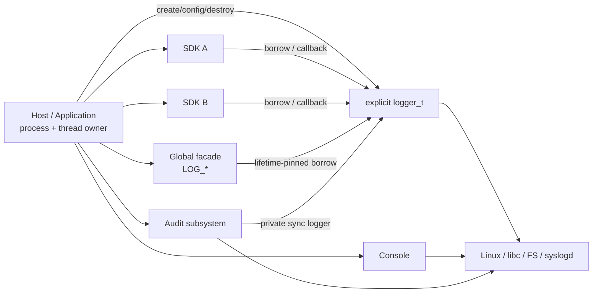
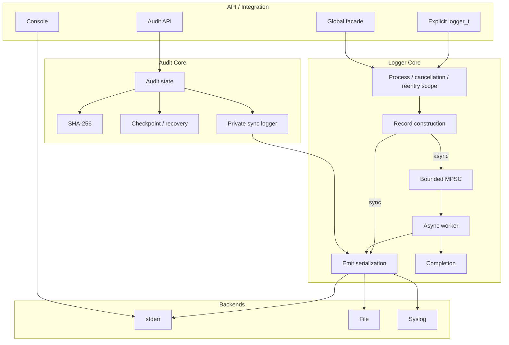
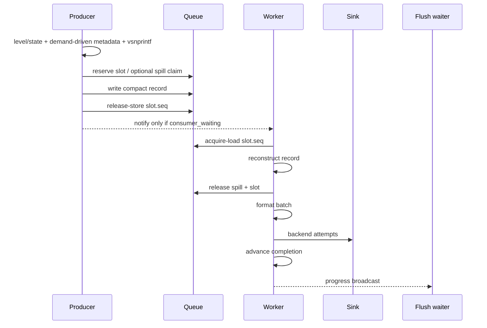
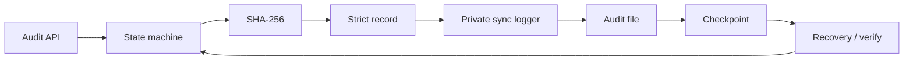

# c-logger 总体架构

> 本文是 c-logger 的**顶层架构入口**。
> 它回答“系统由什么组成、数据怎么流、谁拥有资源、线程如何协作、哪些边界不能被破坏”。
>
> 严格 评审门禁 见 `ARCHITECTURE_INVARIANTS.md`；
> 后端、锁机制、Audit 等实现细节继续以专项文档为准。

## 1. 定位

c-logger 是面向 Linux/ELF 的 C 日志库，主要嵌入宿主应用或第三方 SDK 集成环境。

当前定位：

- 公开 API 是 纯 C ABI；
- C11 语言基线 + GNU C extensions；
- 宿主显式拥有 `logger_t`；
- SDK 默认 借用 Logger 或使用宿主 回调；
- 支持 sync / async 普通日志；
- 支持 stderr、普通文件、本地 datagram Syslog；
- 提供独立 Console；
- 提供独立 Audit 子系统；
- 有界内存；
- 溢出、I/O、持久性 故障 显式可见；
- 不接管宿主 进程/线程/fork 模型。

当前版本仍是发布工程候选，不等于 Production v1 已完成目标平台和掉电语义验收。

## 2. 架构目标

架构优先保证：

1. **Host-neutral**：库不接管宿主业务线程、进程创建和 fork 策略；
2. **明确 所有权**：创建、借用、移交、最终 release 可追踪；
3. **有界资源**：队列、溢出区、工作区 有明确上界；
4. **故障可见性**：不能静默隐藏 溢出、I/O、持久性 或平台能力失败；
5. **确定性生命周期**：工作线程 必须 协作式停止并等待退出；
6. **正确并发**：lock、atomic、生命周期固定、join 各司其职；
7. **调用方生命周期隔离**：异步入队 后不再依赖 SDK 源指针；
8. **有证据支撑的性能**：性能修改必须通过 benchmark 和 sanitizer/TSan 验证。

## 3. 非目标

当前不承诺：

- NanoLog 类极限 binary/deferred logging latency；
- 任意多线程 raw fork 后继续使用继承 运行时；
- 无限 队列 或“永不丢日志”；
- remote Syslog durable acknowledgement/replay；
- 多 消费者 并发写同一普通文件；
- 唤醒信号-safe 普通日志；
- 通用 async-cancel-safe；
- io_uring 作为 Linux 3.10+ 基础依赖；
- 自动管理第三方 SDK 生命周期。

未来可以增加 快速结构化/二进制 API，但不能偷偷改变现有 兼容 printf 的 API 的语义。

## 4. 系统上下文


```mermaid
flowchart LR
    Host["Host / Application\nprocess + thread owner"]
    SDKA["SDK A"]
    SDKB["SDK B"]
    Explicit["explicit logger_t"]
    Global["Global facade\nLOG_*"]
    Console["Console"]
    Audit["Audit subsystem"]
    Linux["Linux / libc / FS / syslogd"]

    Host -->|create/config/destroy| Explicit
    Host --> SDKA
    Host --> SDKB
    SDKA -->|borrow / callback| Explicit
    SDKB -->|borrow / callback| Explicit

    Host --> Global
    Host --> Console
    Host --> Audit

    Global -->|lifetime-pinned borrow| Explicit
    Audit -->|private sync logger| Explicit

    Explicit --> Linux
    Console --> Linux
    Audit --> Linux
```

责任边界：

```text
Host owns
    process
    application threads
    SDK lifetime
    explicit logger_t lifetime
    fork/exec policy

Logger owns
    per-instance worker
    queue + spill
    worker workspace
    file/syslog backend
    completion state

SDK borrower owns
    neither logger_t nor Logger worker/backend
```

## 5. 公开 API 分层

### 显式实例

第三方集成的推荐入口：

```text
logger_create()
    ->
logger_log()/LOGGER_INFO(...)
    ->
logger_flush_instance_status()
    ->
logger_destroy_status()
```

宿主是 结构性所有者。

多个 caller/SDK 可以 借用 同一实例，但 所有者 必须在 销毁 前停止并 join 所有 借用方。

当前没有 generic `logger_get()/logger_put()`；并发 销毁/use 属于 caller 违反生命周期契约。

### 全局门面

`logger_init()/LOG_*/logger_shutdown_status()` 是应用 convenience layer。

内部使用：

- generation + phase atomic ticket；
- controller mutex；
- 生命周期 rwlock；
- hidden `g_logger`。

Global caller 只能 生命周期-pinned 借用，不能取得 owning 指针。

### Console

独立终端工具：

- process-static atomic config；
- 独立 output mutex；
- 不使用 Logger 队列/后端；
- 不作为 SDK 隐式输出通道。

### Audit

独立 process-global security subsystem：

- single 写入器；
- 自己的 state machine；
- private synchronous Logger；
- SHA-256 chain；
- 检查点/recovery；
- fail-closed error state。

普通 Logger 的成功返回不能解释为 Audit commit receipt。

## 6. Component Model


```mermaid
flowchart TB
    subgraph API["API / Integration"]
        E["Explicit logger_t"]
        G["Global facade"]
        C["Console"]
        A["Audit API"]
    end

    subgraph Core["Logger Core"]
        Scope["Process / cancellation / reentry scope"]
        Record["Record construction"]
        Queue["Bounded MPSC"]
        Worker["Async worker"]
        Emit["Emit serialization"]
        Complete["Completion"]
    end

    subgraph Sink["Backends"]
        STDERR["stderr"]
        FILE["File"]
        SYSLOG["Syslog"]
    end

    subgraph AuditCore["Audit Core"]
        State["Audit state"]
        Hash["SHA-256"]
        Ckpt["Checkpoint / recovery"]
        Private["Private sync logger"]
    end

    E --> Scope
    G --> Scope
    Scope --> Record
    Record -->|sync| Emit
    Record -->|async| Queue
    Queue --> Worker
    Worker --> Emit
    Worker --> Complete
    Emit --> STDERR
    Emit --> FILE
    Emit --> SYSLOG

    C --> STDERR

    A --> State
    State --> Hash
    State --> Ckpt
    State --> Private
    Private --> Emit
```

## 7. Thread Model

### Sync 实例

不创建 Logger 工作线程：

```text
caller
  -> construct record
  -> format
  -> emit_mu
  -> backend I/O
  -> return
```

### Async 实例

当前每个 async `logger_t` 创建一个 private 工作线程：

```text
Producer 1 ─┐
Producer 2 ─┼─> bounded shared MPSC ─> single worker ─> sinks
Producer N ─┘
```

single 工作线程 和 shared MPSC 是**当前实现选择**，不是永久 architecture invariant。

如果未来改成 per-thread SPSC/sharding，必须重新处理 TLS registration、dead-thread reclaim、
fork/dlclose、销毁、fairness 和 刷新 aggregation。

## 8. Sync Data Path

```text
public API
  -> process/cancellation/reentry scope
  -> level/state check
  -> timestamp + required metadata
  -> vsnprintf
  -> logger_emit_status()
  -> final line format
  -> emit_mu
  -> stderr/file/syslog
  -> metrics + sticky error
  -> return
```

特点：

- caller input 只需在本次调用期间有效；
- I/O 在 caller thread；
- 没有 队列 buffering；
- status API 可以直接观察 后端 error。

## 9. Async Data Path


```mermaid
sequenceDiagram
    participant P as Producer
    participant Q as Queue
    participant W as Worker
    participant S as Sink
    participant F as Flush waiter

    P->>P: level/state + demand-driven metadata + vsnprintf
    P->>Q: reserve slot / optional spill claim
    P->>Q: write compact record
    P->>Q: release-store slot.seq
    P-->>W: notify only if consumer_waiting
    W->>Q: acquire-load slot.seq
    W->>W: reconstruct record
    W->>Q: release spill + slot
    W->>W: format batch
    W->>S: backend attempts
    W->>W: advance completion
    W-->>F: progress broadcast
```

当前 API 仍是 eager printf-compatible path：

```text
printf args -> vsnprintf -> queue text
```

不是 binary/deferred-format architecture。

未来 fast path 若采用 typed/binary serialization，应作为独立 API/contract。

## 10. Queue / Spill Architecture

当前 队列：

- bounded shared MPSC；
- per-slot sequence generation；
- release/acquire 发布；
- compact metadata/source/context；
- text <= 512B inline；
- text > 512B 使用预分配 溢出区 block；
- 溢出区 所有权 使用 atomic bitmap；
- no per-record malloc/free；
- 工作线程 batch 最大 256。

### Publication

```text
producer
  reserve enqueue position
  -> write compact record / spill
  -> release-store slot.seq

consumer
  acquire-load slot.seq
  -> read/copy record
  -> release spill
  -> release-store reusable slot.seq
  -> advance dequeue_pos
```

`slot.seq` 承担 payload 发布；
`enqueue_pos/dequeue_pos` 主要承担 reservation/accounting。

### Source 生命周期

只有最终 detail/config 真正会输出的 metadata 才在 生产者 采集并进入 队列：

- `NORMAL+`：module；
- `VERBOSE+`：按 `include_pid/include_tid` 采集 pid/tid；
- `DEBUG`：context；
- `DEBUG + include_source`：file/function/line。

需要进入 async 队列 的 module/source 仍做 bounded snapshot，因此 SDK/caller 返回甚至
DSO 合法卸载后，已经入队且未来会被格式化的字段不再依赖原 源指针。

### Spill

默认最多 1024 blocks。

溢出区 是 long-message burst capacity，不是 durable 队列，也不是持续 overload 的解决方案。

## 11. Backpressure

队列/溢出区 无资源时：

```text
unavailable
    |
    +-- DROP
    |    -> dropped_by_level++
    |
    +-- SYNC
         -> caller thread synchronous emit
         -> sync_fallbacks++
```

默认 ERROR/FATAL 使用 SYNC fallback，其余级别默认 DROP。

buffer sizing 应理解为：

```text
burst capacity
≈ peak producer rate × tolerated consumer stall
```

而不是让持续 生产者 rate > 消费者 rate 永久成立。

## 12. Worker / Batch / Sinks

工作线程 当前：

```text
drain <= 256 records
  -> format each line
  -> emit batch
  -> update completion
  -> continue

queue empty
  -> wait on q.wait_cv
```

sink 当前行为：

| Sink | Async batch |
|---|---|
| stderr | `writev` |
| file | `writev` |
| Syslog | per-record `send` |

当前 wakeup 已改为 self-paced：工作线程 只有在 队列 空并准备进入 cond_wait 时才
发布 `consumer_waiting=1`；生产者 只有观察到该状态才进入
`wait_mu + cond_signal` slow path。shutdown 使用独立 强制唤醒。

因此当前明确的未来候选包括：

- 消费者-stage profiling；
- Syslog `sendmmsg()`；
- adaptive batch/backpressure。

## 13. 完成 / 刷新

最重要的 invariant：

> **队列为空 / 出队 != 后端完成。**

三个状态：

```text
dequeue_pos
    = slot 已被 consumer 取得

async_completed
    = backend attempt 完成

completed_pos
    = flush/wait 使用的 watermark
```

刷新：

```text
snapshot reservation target
  -> wait completed_pos reaches target
  -> backend sync if required
```

不能把“队列 空了”解释成“已经 write/fsync”。

## 14. Backend Model

### stderr

- sync path 单 record；
- async path batch `writev`；
- SIGPIPE 使用 线程本地 mask guard；
- 不改变 process-global 唤醒信号 disposition。

### File

一个 file 后端 结构性所有者 持有：

```text
dir_fd
active fd
coordination lock fd
rotation/reopen state
```

关键规则：

- regular target 单协作 所有者；
- bind 后通过 dirfd 操作；
- no-clobber rotation；
- 替代对象 完成验证后再切换；
- fsync/dir fsync error 可观察；
- coordination lock 是 所有权/exclusivity，不是安全防篡改边界。

细节见 `FILE_BACKEND.md`。

### Syslog

当前是 local UNIX datagram：

- nonb锁机制；
- bounded send attempts；
- monotonic reconnect cooldown；
- future-record-triggered reconnect；
- no replay 队列；
- backpressure 作为 failed record 可见。

细节见 `SYSLOG_BACKEND.md`。

## 15. Ownership / Lifecycle

核心状态：

```text
OWNED
BORROWED
MOVED
SHARED
REFCOUNTED
```

当前 production 没有 generic REFCOUNTED object。

### Logger lifecycle


```mermaid
flowchart LR
    A["allocate"]
    I["init mutex/backend/queue/workspace"]
    W["start worker if async"]
    R["RUNNING"]
    S["STOPPING"]
    J["stop + join worker"]
    D["sync/close/release"]
    F["free"]

    A --> I --> W --> R --> S --> J --> D --> F
```

successful constructor 只在 return boundary 把 所有权 交给 caller。

销毁 消费s 所有权；final I/O error 不代表旧 指针 可重试。

### Worker/队列 release order

```text
stop admission/running
  -> wake worker
  -> worker drain/exit
  -> pthread_join
  -> destroy workspace
  -> destroy queue
```

### Global 生命周期

Global reader 持 生命周期 rwlock pin 时 借用 hidden `g_logger`。

该 pin 不是 refcount。

详细规则见 所有权/lifecycle 专项文档。

## 16. Lock / Atomic Model

不同机制不可混用：

```text
lock
  -> serialize invariant

atomic
  -> publication / individual state

lifetime pin
  -> object stays alive while borrowed

join
  -> worker no longer uses resources

refcount
  -> independent owners retain lifetime
```

### Global lock order

```text
g_control_mu
  -> g_lifetime_lock
  -> logger instance locks
```

### Instance synchronization

```text
emit_mu
  -> backend mutable state / output order

progress_mu
  -> completed_pos / progress_cv

q.wait_mu
  -> worker sleep/wakeup only
```

Queue atomics：

```text
slot.seq        payload publication/reuse
enqueue_pos     reservation
dequeue_pos     consumption accounting
spill_used[]    spill block ownership
running         worker stop state
```

完整顺序见 `LOCKING.md`、`LOCK_MATRIX.md`、`CONCURRENCY.md`。

## 17. Error / Durability

内部 helper 通常：

```text
0 / -errno
```

POSIX-style public status API 通常：

```text
0 / -1 + errno
```

核心原则：

- preserve first meaningful error；
- 后端 first I/O error sticky；
- partial write 不静默 success；
- error-bearing finalization 保持显式；
- unsupported capability 返回错误，不做危险降级。

普通 Logger：

```text
enqueue success
  != backend completion
  != fsync durability
```

Audit 持久性 是独立契约，不能从普通 Logger 推导。

## 18. Process / Fork / Cancellation

Logger 不拥有宿主 process model。

默认路径：

- 不调用 fork；
- 不扫描宿主线程决定 fork safety；
- raw multi-threaded fork 子进程 在触碰继承锁前 ECHILD；
- 推荐 fork-before-运行时-use 或 fork+exec；
- legacy controlled helper 仅 opt-in。

普通 Logger/Console resource path：

- deferred cancellation 在关键区间暂时禁用；
- cleanup/lock release 后恢复 caller state；
- same-thread resource reentry 在拿锁前拒绝；
- 不宣称通用 async-cancel-safe；
- 不允许 `pthread_exit/longjmp` 绕过资源协议。

## 19. Audit Architecture


```mermaid
flowchart LR
    API["Audit API"]
    State["State machine"]
    Hash["SHA-256"]
    Log["Strict record"]
    Logger["Private sync logger"]
    File["Audit file"]
    Ckpt["Checkpoint"]
    Recovery["Recovery / verify"]

    API --> State --> Hash --> Log --> Logger --> File --> Ckpt
    Ckpt --> Recovery --> State
```

关键边界：

- process-global single 写入器；
- private Logger 使用 sync mode；
- crypto 故障 fail closed；
- unsupported algorithm 不自动映射；
- committed log 与 检查点 是不同状态；
- uncertain I/O/crypto 进入显式 故障 state；
- recovery 不静默改写历史证据；
- recovery 前先建立 写入器 所有权。

Audit security/持久性 优先级高于普通日志 throughput。

## 20. Performance Architecture

当前 async compatibility path 的性能原则：

- bounded preallocation；
- no per-record heap allocation；
- compact 队列；
- short text inline；
- batch format/writev；
- 生产者/工作线程 concurrency；
- benchmark-backed tuning。

已完成的 队列 优化结果见：

- `../validation/QUEUE_BENCHMARK.md`
- `../validation/QUEUE_HOTPATH.md`

### Current implementation，允许演进

- shared MPSC；
- single 工作线程；
- 512B inline；
- 1024 溢出区 blocks；
- atomic 溢出区 bitmap；
- BATCH_MAX=256；
- eager `vsnprintf`；
- demand-driven metadata capture；
- self-paced 工作线程 wakeup policy；
- sink batching。

### Architecture invariant，不得用性能优化破坏

- 有界内存；
- no per-record async malloc in compatibility path；
- explicit 溢出 policy；
- no silent 溢出 truncation；
- source 生命周期 detached after en队列；
- 刷新 != 队列为空；
- 后端 error visible；
- 所有者 controls 工作线程 生命周期；
- 释放前等待退出；
- file ordering/所有权；
- host-neutral process/thread boundary。

完整规则见 `ARCHITECTURE_INVARIANTS.md`。

## 21. Extension Boundaries

### 新 后端

至少必须定义：

- 结构性所有者；
- init/close；
- 锁机制；
- batching；
- backpressure；
- retry/reconnect；
- error metrics；
- 持久性；
- fork/dlclose boundary。

### 新 队列拓扑

SPSC shard/per-thread 队列 必须重新证明：

- bounded total memory；
- TLS 生命周期/reclaim；
- logger 销毁；
- fork/dlclose；
- fairness/order；
- 刷新 completion aggregation；
- source 所有权；
- backpressure。

### 新 fast logging API

应明确区分：

```text
existing API
  -> eager printf-compatible copy

future fast API
  -> typed/binary serialization
  -> deferred format
```

不能让旧 API 在 caller return 后继续借用可变 printf 参数。

## 22. Near-term Evolution

当前推荐顺序：

```text
consumer stage profiling
  ->
Syslog batching if evidence supports
  ->
adaptive batch/backpressure
  ->
evaluate queue sharding / per-thread SPSC
  ->
optional binary structured fast API
```

每轮必须：

- 保留 架构不变量；
- 更新专项文档；
- 增加 correctness regression；
- 通过 Release/Debug/ASan/UBSan/TSan；
- 性能使用同 runner before/after benchmark。

## 23. Documentation Authority

| 主题 | 权威文档 |
|---|---|
| 总体组件 / 数据流 / 边界 | **ARCHITECTURE.md** |
| 不可破坏 评审门禁 | **ARCHITECTURE_INVARIANTS.md** |
| 公开 API / integration | `../API.md`, `HOST_OWNED.md` |
| lifecycle | `LIFECYCLE.md`, `GLOBAL_LIFECYCLE.md` |
| 所有权 | `RESOURCE_OWNERSHIP.md`, `RESOURCE_OWNERSHIP_MATRIX.md` |
| refcount | `REFCOUNTING.md` |
| cleanup | `RESOURCE_CLEANUP.md` |
| lock hierarchy | `LOCKING.md`, `LOCK_MATRIX.md` |
| atomic/发布 | `CONCURRENCY.md` |
| 队列 | `QUEUE_STORAGE.md` |
| errors | `ERROR_HANDLING.md` |
| file | `FILE_BACKEND.md` |
| syslog | `SYSLOG_BACKEND.md` |
| crypto | `BUILTIN_CRYPTO.md` |
| platform | `PLATFORM_BASELINE.md` |
| release | `RELEASE_ENGINEERING.md` |
| unresolved boundaries | `KNOWN_ISSUES.md` |

发生冲突时：

1. 先判断是否属于 architecture change；
2. architecture change 必须同一 PR 更新顶层文档和专项文档；
3. 单纯实现细节以专项文档为准，但不能违反 架构不变量。
